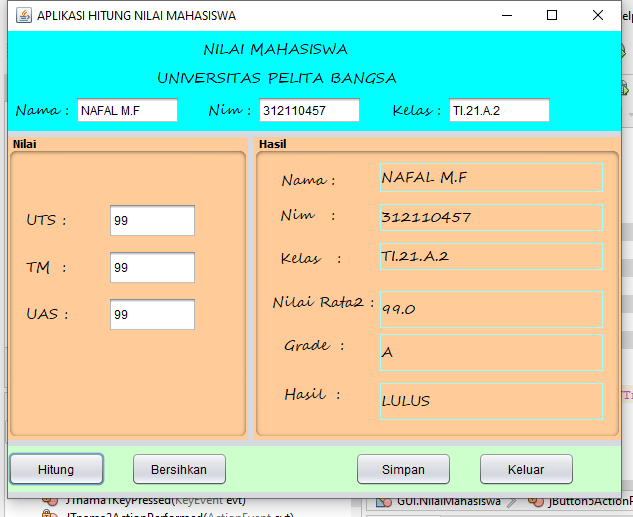
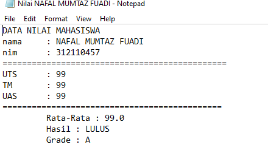

okeh sebelumnyah perkenal kan dulu nama saya hehhe biar kenal pepatah berkata tak kenal maka tak sayang, Maka dari itu kenal kan nama saya adalah.. mas nafal

## Aplikasi sederhana untuk mengelola nilai mahasiswa menggunakan Java dan NetBeans.

## Deskripsi

Aplikasi ini dibuat untuk membantu pengelolaan nilai mahasiswa di suatu institusi pendidikan. Aplikasi dapat digunakan untuk menambahkan data mahasiswa, menginput nilai, dan menghitung rata-rata nilai.
okeh .. temen-temen mungkin di bawah ini adalah salah satu hasil nyah !!

## Fitur

- **Tambahkan Mahasiswa**: Inputkan informasi mahasiswa, seperti nama dan NIM, ke dalam sistem.
  
- **Input Nilai**: Masukkan nilai untuk setiap mahasiswa pada setiap mata kuliah.

- **Hitung Rata-rata Nilai**: Hitung otomatis rata-rata nilai mahasiswa untuk setiap mata kuliah.

### MENAMPILAN GUI YAH GUYS MODIF 

## MENAMPILAN LAPORAN

## Teknologi

Aplikasi ini dibangun menggunakan Java dan dikembangkan menggunakan IDE NetBeans. Berikut adalah beberapa teknologi dan konsep yang digunakan:

- Java
- NetBeans IDE
- Swing untuk antarmuka pengguna
- Konsep pemrograman berorientasi objek (OOP)
- Konsep dasar pemrograman GUI

## Instalasi

1. Pastikan Anda memiliki NetBeans IDE dan JDK terinstal di sistem Anda.
2. Clone repositori ini ke komputer Anda.
3. Buka proyek menggunakan NetBeans.
4. Jalankan aplikasi dari NetBeans IDE.

## jika ada pertanyaan apa sajah lainyah hubungi saya ajah wkwkwk

## Kontribusi

Jika Anda ingin berkontribusi pada pengembangan proyek ini, silakan buat _pull request_ dan kami akan meriview kontribusi Anda.

## Lisensi

Proyek ini dilisensikan di bawah Lisensi MIT - lihat berkas [LICENSE](LICENSE) untuk detail lebih lanjut.

---

Selamat menggunakan aplikasi Nilai Mahasiswa! Jika Anda memiliki pertanyaan atau saran, jangan ragu untuk membuat _issue_ di repositori ini.
